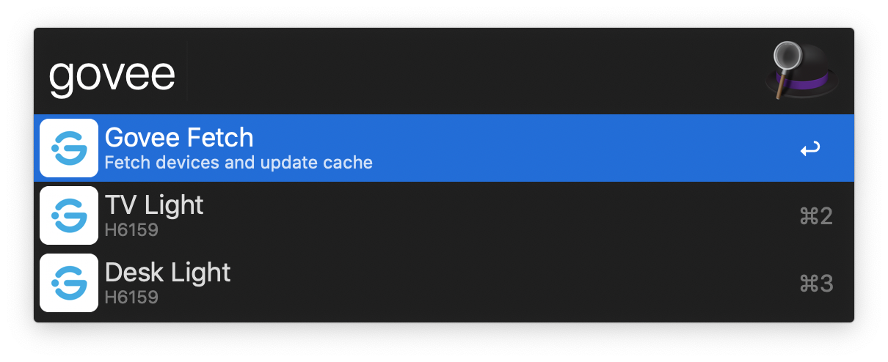
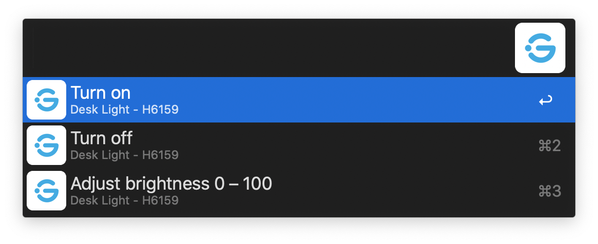

  <h1>Alfred Govee 💡</h1>

  <strong>Workflow to interact with your Govee devices</strong> 
  

## Installation

1. Download the Alfred Workflow ([Govee.alfredworkflow](https://github.com/epilande/alfred-govee/releases/latest/download/Govee.alfredworkflow)).
1. Double-click to import into Alfred (requires Powerpack).
1. Set `API_KEY`. To get your `API_KEY`, open the Govee app, go to My Profile -> About Us -> Apply for API key.

## Usage

- `govee fetch` - Fetch Govee devices and update local cache.
- `govee {deviceName}` - Select device to interact with. If device is missing, run `govee fetch`.

After selecting a device, you will be prompted with 3 options:

## Variables

| Key       | Default | Description                       |
| --------- | ------- | --------------------------------- |
| `API_KEY` |         | Govee API Key for authentication. |

## Demo

## More workflows

- 🔍 [alfred-browser-tabs](https://github.com/epilande/alfred-browser-tabs) - Search browser tabs from Chrome, Brave, & Safari.
- 🤫 [alfred-be-quiet](https://github.com/epilande/alfred-be-quiet) - Workflow to automatically pause audio/video playing.
- 🔐 [alfred-wifi-password](https://github.com/epilande/alfred-wifi-password) - Get Wi-Fi password from Keychain.
- 🗝 [alfred-password-generator](https://github.com/epilande/alfred-password-generator) - Workflow to generate passwords.
- 🎨 [alfred-prettier-clipboard](https://github.com/epilande/alfred-prettier-clipboard) - Format code in your clipboard with Prettier.
- 🖊 [alfred-markdown](https://github.com/epilande/alfred-markdown) - Markdown text expander.
- 💬 [alfred-words](https://github.com/epilande/alfred-words) - Find synonyms and antonyms from thesaurus.com.

## License

[MIT License](https://oss.ninja/mit/epilande/)
